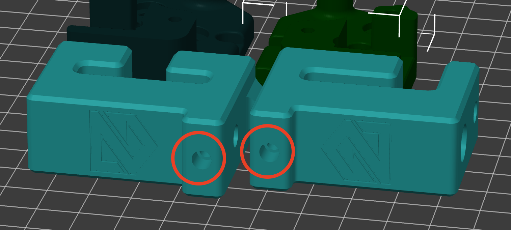
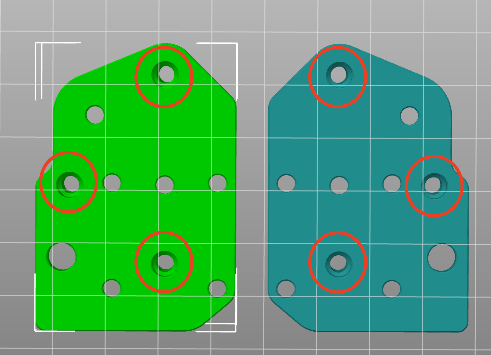

# Table of Contents

- <a href="#print-settings">Print Settings for Mercury One Printed Parts</a>
- <a href="#heatsets"> Heat-Set Inserts</a>
- <a href="#tips">Tips and Tricks</a>

# Print Settings for Mercury One Printed Parts

Recommended Materials: ABS

[Print settings as recommended by ZeroG](https://docs.zerog.one/standard/print/settings):

- First layer height 0.25mm ("Yes, you have to… Our parts have been designed for this")
- Layer height: 0.2mm
- Extrusion width: 0.4mm, forced
- Infill pecentage: 40%
- Infill type: Adaptive Cubic, grid, gyroid, honeycomb, triangle, or cubic
- Wall count: 4
- Solid top/bottom layers: 5
- Supports: NONE

# Heat-set Inserts

Heat-set inserts should be prepared ahead of project assembly. Parts that require heat-set inserts are:

1. Front Towers: Each tower (left and right) gets one heat-set insert to prevent stripping during belt tensioning.

> 

2. X Joint Bottoms: The bottom half of each X Joint requires 3x heat-set inserts to prevent stripping when clamping the X Joint halves together.

> 

# Tips and Tricks

## Printing Tips

- These are structural parts and, as such, require special consideration when printing. ABS is recommended both due to its heat resistance and its tensile strength under load.
- A high infill percentage and shell/wall/perimeter count is required for these parts to avoid breaking under tension.
- Some of these components may be exposed to direct sources of heat, such as the stepper motor mounts. Where possible, ensure that any components with the potential to emit heat are correctly calibrated and installed. Long-term exposure to heat will cause printed parts to disfigure and warp.

## Installation Tips

- When installing printed parts, take special care NOT to over-tighten screws or hardware. Despite the strength of ABS and the recommended print settings, it is still possible to damage plastic parts by over-tightening fasteners.

## Aesthetics

- If you care about the aesthetics of the final product, take print speed and acceleration into account. Some pieces have small details or logos that may not print well on an untuned printer.
- Consider your color choice ahead of time and ensure that you have enough filament to print the objects in the colors you want.
